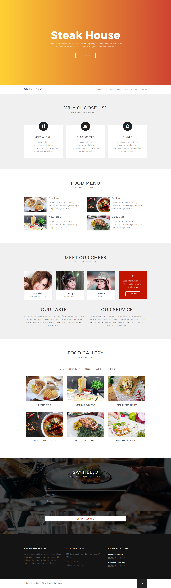

# html-css-steak-house-template

## Screen
### Screen poglądowy wykorzystany jako wzór.

### Icons
[Font Awesome](http://fontawesome.io/)

### Fonts
[Source Sans Pro](https://fonts.google.com/specimen/Source+Sans+Pro)

[Montserrat](https://fonts.google.com/specimen/Montserrat)